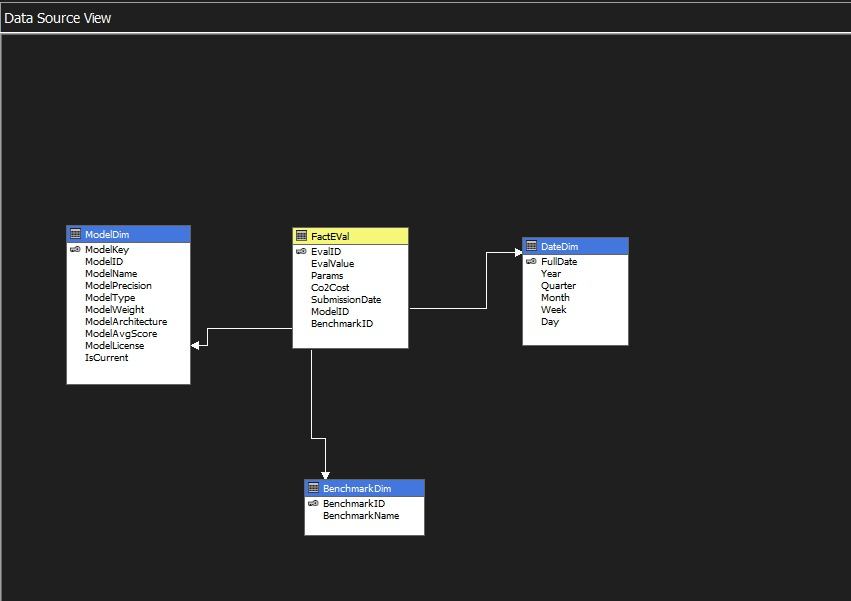
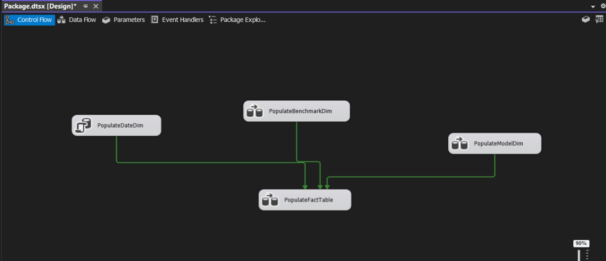
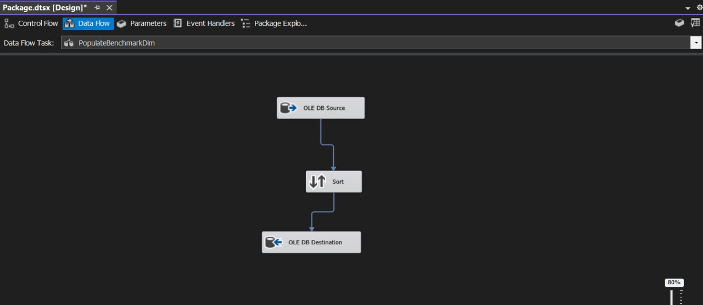
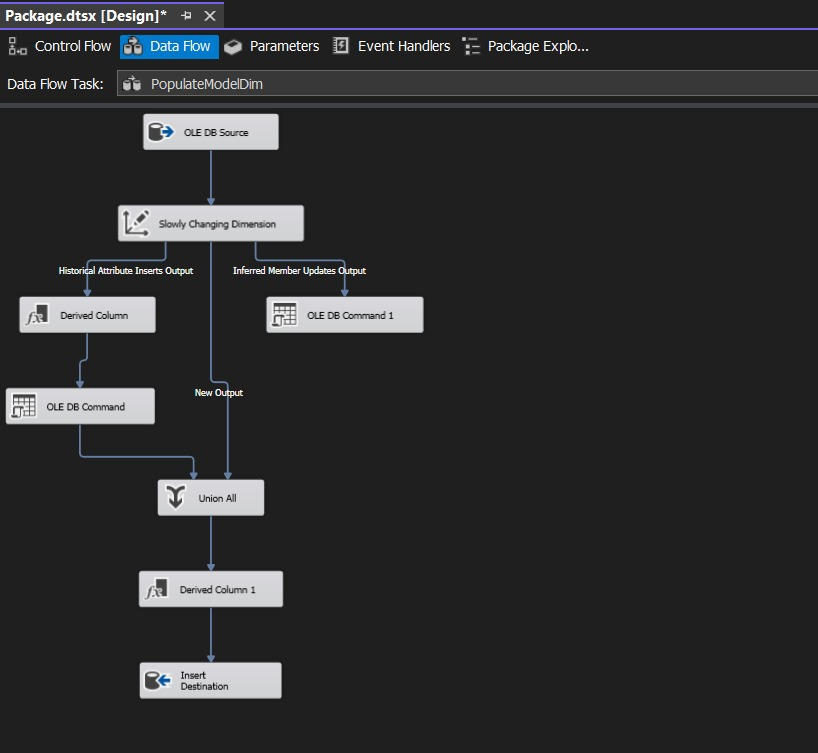
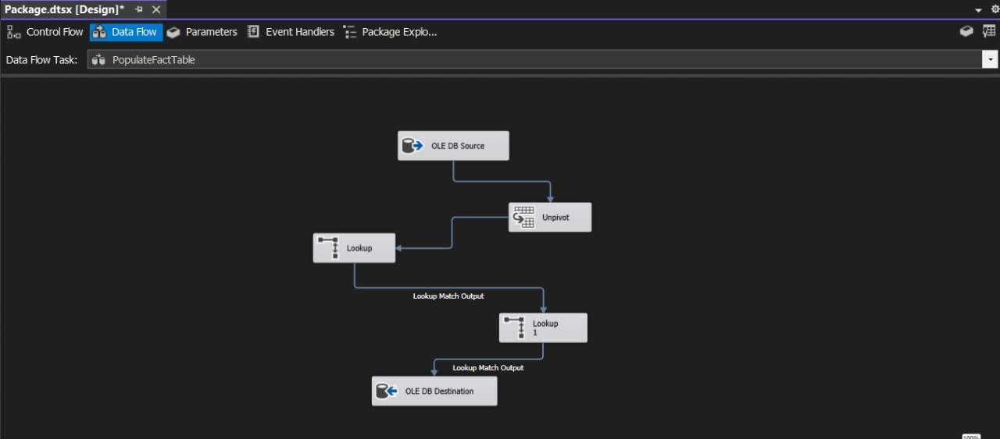
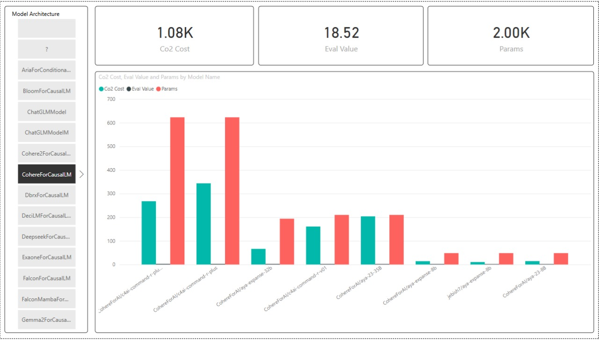

# 📦 LLM Evaluation Data Warehousing & Analytics

## 📌 Project Summary  
This project leverages the **Microsoft BI stack (SQL Server, SSIS, SSAS, Power BI)** to build a **complete analytical data warehousing solution** for **LLM (Large Language Model) evaluation data**. The goal is to centralize benchmark results, enable multidimensional analysis, and support data-driven decisions regarding **model performance**, **resource consumption**, and **environmental sustainability**.

---

## 🧰 Technology Stack  

| Layer     | Technology         |
|--------   |--------------------|
| Database  | SQL Server (DW)    |
| ETL       | SSIS               |
| OLAP      | SSAS               |
| BI        | Microsoft Power BI |

---

## 🎯 Analytical Objective  

The objective is to **benchmark and analyse LLM performance versus cost and environmental impact**, using KPIs that can be explored **across multiple analytical dimensions**.

### 📈 Core KPIs  

| Metric            | Description                                    |
|-------------------|------------------------------------------------|
| **Eval Value**    | Primary benchmark score from evaluation engine |
| **Params (M)**    | Total model parameter count                    |
| **CO₂ Cost (kg)** | Estimated carbon emissions                     |

### 🧩 Required Analytical Slicing Dimensions  
The cube must support slicing, filtering, and drill-down across **three perspectives**:

1. **Time** — Day → Month → Quarter → Year  
2. **Model Attributes** — architecture, license, precision, hardware, etc.  
3. **Benchmark Type** — benchmark suite, category, or dataset  

---

## 🗄️ Data Modeling  

This project employs a **classic dimensional modeling approach**:  

- **Star Schema** for analytical reporting  
- **Multidimensional Cube (SSAS)** for OLAP exploration  

---

## 🔁 ETL Architecture (SSIS)

1️⃣ **High-Level ETL Flow — conceptual data movement**

2️⃣ **BenchmarkDim**

3- **ModelDim**

4- **FactTable**

---

## 🧮 OLAP Cube Architecture (SSAS)

### 📊 Dimension Design  

| Dimension     | Key Elements                            |
|---------------|-----------------------------------------|
| **Date**      | Hierarchy: Year → Quarter → Month → Day |
| **Model**     | Surrogate ModelKey + attributes         |
| **Benchmark** | Category → BenchmarkName                |

### 🧩 Measures & Calculation Logic  

| Measure              | Formula                        | Aggregation |
|----------------------|--------------------------------|-------------|
| **Total CO₂ Cost**   | `SUM(FactEval[Co2Cost])`       | Sum         |
| **Avg Eval Value**   | `AVERAGE(FactEval[EvalValue])` | Average     |
| **Total Params (M)** | `SUM(FactEval[Params])`        | Sum         |

---

## 📊 Dashboard Overview  
A Power BI dashboard is built to explore model performance, cost, and trade-offs interactively.

Recommended views:
- Eval Value vs CO₂ Cost correlation  
- Model size heatmap  
- Time-series evolution of benchmark performance  
- Architecture-based comparison slicer  

---

## 🔍 Main Insights  

**High-accuracy models (Eval Value > 600) often incur 2–3× more CO₂ than mid-range models**, suggesting diminishing returns at the high end.  

**Certain lightweight architectures achieve competitive performance at ≤10M parameters**, revealing opportunities for sustainable deployment.  

**Benchmark slicing exposes generalist vs specialist models:**  
   - Generalists maintain stable scores across benchmarks  
   - Specialists excel only on specific datasets  

